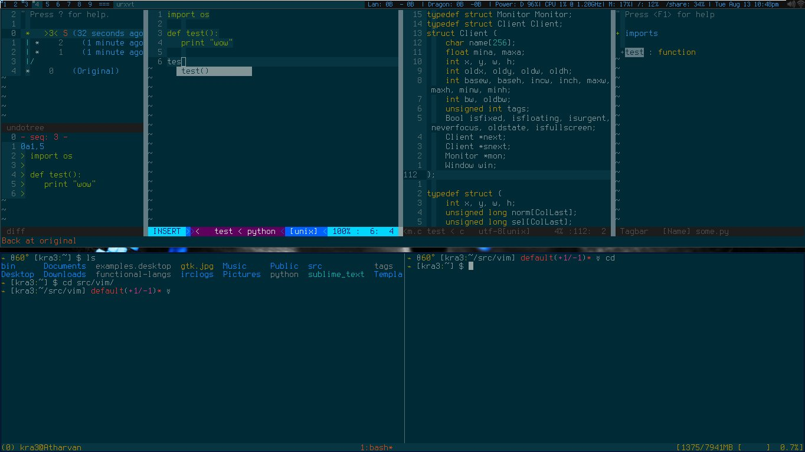
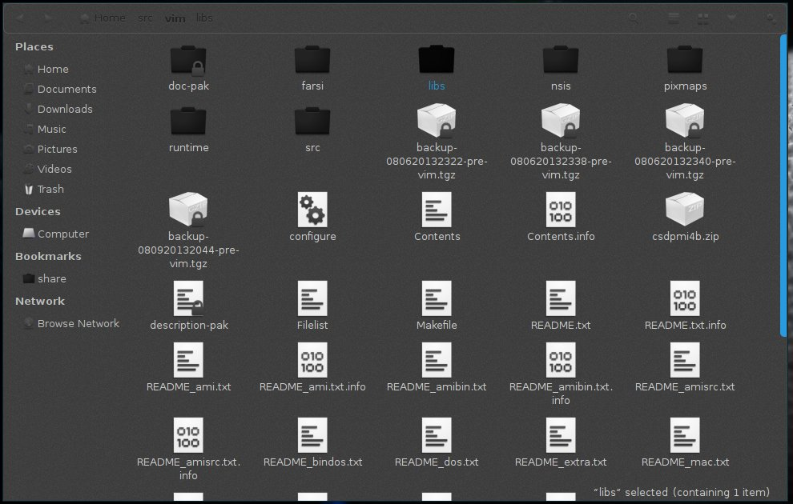

There are 3 other projects in use as of now, (2 to show cpu & mem load and & another for a better prompt.)
- screen-cpu-mem-load
- tmux-cpu-mem-load
- liquidprompt 

Also, one gist of virtualenvwrapper hooks for python development

To get them:

```bash
git submodule init
git submodule update
```

You have to compile cpu-mem-load plugins ( I may write a script for it to avoid this step. )
You need cmake to generate make files

```bash
cd tmux/addon            # or screen  if you prefer it - cd screen/addon  
cmake .
make
sudo make install
```
### Vim

link .vimrc and .gvimrc to ~ and run

```bash
git clone https://github.com/gmarik/vundle.git ~/.vim/bundle/vundle
```

Then start vim and execute command BundleInstall in command mode

### Python development: 

install virtualenv & virtualenvwrapper.
Follow the directions in the readme on my [gist](https://gist.github.com/kra3/6224580) for virtualenvwrapper hooks
for installation, follow the readme, now located at `./virtualenv_wrapper_hooks/readme.md`; it explains the modules used.


### For GUI goodness

- Icons: AwOken -  http://gnome-look.org/content/show.php?content=126344
- Gtk-theme - Malys-rought-dark-left - http://malysss.deviantart.com/art/malys-rought-2-0-for-gnome-3-6-337626780

Which in ubuntu can be achived by:

``` bash
sudo apt-get install gtk2-engines-pixbuf    # for GTK2
sudo apt-get install gtk3-engines-unico     # for GTK3
sudo add-apt-repository ppa:noobslab/malys-themes
sudo add-apt-repository ppa:alecive/antigone
sudo apt-get update
sudo apt-get install malys-rought
sudo apt-get install awoken-icon-theme
awoken-icon-theme-customization  # And follow instructions to select one out of many icon variations
# for font used by theme
mkdir ~/.fonts
wget -O bahamas-font.zip http://dl.dropbox.com/u/53319850/NoobsLab.com/bahamas-font.zip
unzip bahamas-font.zip -d ~/.fonts
```


NB: I don't use zsh, it's just a curiosity

### Screenshots

This one shows almost all of the configurations, may be not in a best way
- DWM window manager
- Conky -  for status line
- tmux - bottom terminal with 2 panes open
- Vim (shows undotree, tagbar, youcompleteme, airline in action)
- Fully solarized! including dwm, vim, bash, tmux, screen & what not entire x11 apps.
- Ues terminus font everywhere (except gtk theme - theme uses bahamas fonts for extra symbols)



Nautilus as an example of gtk theme and icons: 
For those rare instances you need a gui app other than browser & media player, you shouldn't be embarrassed ;-)



